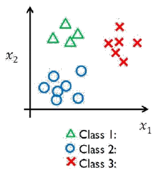
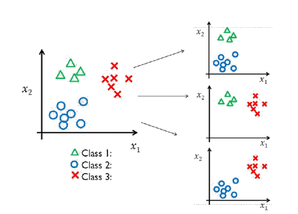

# cbmLAD: Logical Analysis of Data for Condition-Based Maintenance

**cbmLAD** is a software tool implementing the **Logical Analysis of Data (LAD)** methodology, tailored for **Condition-Based Maintenance** applications. It leverages data pattern mining to detect failure signatures and classify machine conditions from sensor data.

## 🔧 Core Components

- **Boolean Logic**: Binarization and threshold generation of features.
- **Combinatorics**: Pattern selection from binary data.
- **Optimization**: Uses Ant Colony Optimization (ACO) to find optimal pattern sets.

---

## 📁 CBM–LAD Instructions

### 📂 Directory Structure

A folder named `cbmLAD` must be created on the **C drive**: `C:\\cbmLAD`

This directory will include:
- Input files (3 required `.txt` files)
- Output files (automatically generated during execution)

### 📥 Input Files

Three input files must be created before running the software:

#### 1. `raw_data.txt`

**Columns:**
- Column 1: Class labels (must not include `0`)
- Remaining columns: Feature values  
  (Nominal values must be **converted to discrete integers**)

**Rows:**
- Row 1: Feature names
- Row 2: Feature types:

| Type | Description |
|------|-------------|
| 1    | Nominal (e.g., red, green → must be converted to numbers) |
| 2    | Binary (0 or 1) |
| 3    | Numerical (integer or real numbers) |

- Remaining rows: Data samples

**Important Notes:**
- First cell in row 2 (top-left) must be `3`.
- Class labels **must not include 0**.  
  Example: If original classes are `{0, 1, 2}`, change to `{1, 2, 3}`.

#### 2. `test_data.txt`

Same format as `raw_data.txt`, **without**:
- Feature names (row 1)
- Feature types (row 2)

#### 3. `classification_data.txt`

Same format as `test_data.txt`, **without**:
- First column (class labels)

---

## 📤 Output Files

Output `.txt` files will be automatically generated in the same folder (`C:\\cbmLAD`) during program execution.

## 🧠 Pattern Generation Methods: One-vs-All (OVA) and One-vs-One (OVO)

cbmLAD supports two major strategies for handling **multiclass** problems:

### 🟢 One-vs-All (OVA)

- Each class is compared **against all other classes combined**.
- Patterns are generated per class as:
  - $P_1^+, P_1^-, P_2^+, P_2^-, \\ldots$
    

---

### 🔵 One-vs-One (OVO)

- Each class is compared **against one other class at a time**.
- Patterns are generated for each binary comparison:
  - $P_{1v2}, P_{2v1}, P_{1v3}, P_{3v1}, \\ldots$

---

### 🔎 Notes

- **Binary classes:** Only the **OVA** method is used.
- **Multiclass:** Both **OVA** and **OVO** methods can be applied.

To perform training, classification, and testing using these methods, use the **executable files** provided in the `Executable Files` directory.
