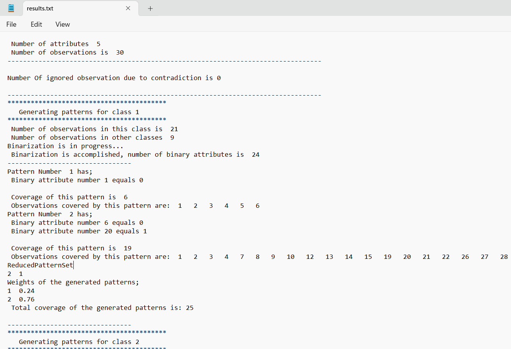

# cbmLAD: Logical Analysis of Data for Condition-Based Maintenance

**cbmLAD** is a software tool implementing the **Logical Analysis of Data (LAD)** methodology, tailored for **Condition-Based Maintenance** applications. It leverages data pattern mining to detect failure signatures and classify machine conditions from sensor data.

## 🔧 Core Components

- **Boolean Logic**: Binarization of features and cut points generation.
- **Combinatorics**: Patterns' generation from binary data.
- **Optimization**: Uses Ant Colony Optimization (ACO) to find the optimal support set.

---

## 📁 cbmLAD Instructions

### 📂 Directory Structure

A folder named `cbmLAD` must be created on the **C drive**: `C:\\cbmLAD`

This directory will include:
-  3 Input files (.txt` files)
- Output files (automatically generated during execution)

### 📥 Input Files

Three input files must be created before running the software:

#### 1. `raw data.txt`

**Columns:**
- Column 1: Class labels 1, 2, 3,... (must not include `0`)
- Remaining columns: Feature values  
  (Nominal values must be **converted to discrete integers**)

**Rows:**
- Row 1: Feature names
- Row 2: Feature types: Nominal, binary, or numerical
- Row 3: sensors' readings or data

| Type | Description |
|------|-------------|
| 1    | Nominal (e.g., red, green → must be converted to numbers) |
| 2    | Binary (0 or 1) |
| 3    | Numerical (integer or real numbers) |

- Remaining rows: Data samples

**Important Notes:**
- First cell in row 2 (top-left) must be `3`.
- Class labels **must not include 0**.  
  Example: If original classes are `{0, 1, 2}`, change to `{1, 2, 3}`.

This is an example of the raw data file.

 

#### 2. `test data.txt`

Same format as `raw_data.txt`, **without**:
- Feature names (row 1)
- Feature types (row 2)

This is an example of the test data file.

 

#### 3. `classification_data.txt`

Same format as `test_data.txt`, **without**:
- First column (class labels)

This is an example of a classification data file.

 

## 📤 Output Files

For each operation performed by cbmLAD (training, testing, and classification), specific output `.txt` files are generated and saved in the working directory `C:\\cbmLAD`.

### 🔧 4.1 Training Results

The training operation produces the following files:

- **Class names.txt**: Lists all class labels present in the dataset.
- **Duplicated and Ignored Observations.txt**: Identifies and excludes duplicated or invalid rows.
- **Characteristics of the generated patterns.txt**: Summarizes details about each generated pattern, such as coverage, relative prevalence, and weight. The following figure shows an example.

 

- **Binary data.txt**: This file includes the binary attributes that resulted from the binarization process. The following figure shows an example. 

 

- **Coverage of Multi-Class Patterns.txt**: Indicates the observations in which the patterns generated for each class were found and includes their weights. Patterns with high weights cover more observations, thus have more explanatory power than patterns with low weights.

 

- **Patterns interpreted.txt**: Provides a readable representation of patterns for each class using feature names and values, connected by logical AND operations.

 

- **Cut points.txt**: Shows the thresholds (cut points) used to convert numeric and nominal values into binary form.

 
  
- **Results.txt**: The core output file that summarizes the input data and the final patterns for each class, including their weights and coverages. The order of class operations is determined by which class is internally treated by cbmLAD first.

 

### 🧪 4.2 Testing Results

After the testing process, cbmLAD generates:

- **Testing results.txt**: This file contains:
  - The predicted class for each test observation.
  - The discriminant scores that indicate how strongly the membership of an observation is to one of the classes
  - The overall accuracy of the test predictions.
    
This is an example of the testing results file related to binary classification using the OVA method. To clarify the presented information, we explain the results corresponding to the first observation. The values highlighted in blue and red represent the discriminant scores for class 1 and class 2, respectively. Since the discriminant score for class 1 is higher, the observation is predicted as class 1, even though it was originally labeled as class 2.

Next, we examine the patterns covering this observation. Two patterns are involved, both associated with class 1: pattern [1]1 and pattern [1]2. Their respective weights—0.24 for [1]1 and 0.76 for [1]2—are provided in **Coverage of Multi-Class Patterns.txt**. The sum of these weights is 1, which corresponds to the discriminant score for class 1. Since no pattern related to class 2 covers this observation, the discriminant score for class 2 is 0. The definitions of these patterns can be found in **Patterns interpreted.txt**.

 

Another example is provided for a multi-class classification problem using the OVO method. In this case, the target variable consists of four classes. The line labeled Classes scores displays the discriminant scores for each class. Since the highest score corresponds to class 4, the first observation is predicted as belonging to class 4.

The following line lists the patterns that cover this observation. For class 4 specifically, five patterns are involved: [4V2]1, [4V1]1, [4V1]2, [4V3]1, and [4V3]2. Their respective weights—0.947368, 0.782609, 0.217391, 0.666667, and 0.333333—are provided in **Coverage of Multi-Class Patterns.txt**. The sum of these weights is 2.947368, which corresponds to the discriminant score for class 4. The definitions of these patterns can be found in **Patterns interpreted.txt**.

 

- **Confusion Matrix.txt**: Displays the confusion matrix, which summarizes prediction performance during testing by showing the number of instances correctly and incorrectly classified for each class.

  - The rows represent the actual classes.

  - The columns represent the predicted classes.

  - Each cell shows the count of observations falling into that actual-predicted pair.

  Interpretation:

  - True Positives (TP): Correct predictions for a specific class (diagonal elements).

  - False Positives (FP): Instances incorrectly predicted as a given class (non-diagonal elements in the column).

  - False Negatives (FN): Instances of a given class incorrectly predicted as another class (non-diagonal elements in the row).

  - True Negatives (TN): Instances correctly rejected as not belonging to the class.

   

  This is an example of confusion matrix results.

   

- **Confused Observations.txt**: Lists specific testing observations that were misclassified or inconsistently covered by patterns.

 

### 🧮 4.3 Classification Results

When performing classification (on new, unlabeled data), cbmLAD generates:

- **Classification results.txt**: This file provides:
  - Predicted class labels for new observations.
  - Discriminant scores for each possible class.
  - The patterns used to justify each classification.

This is an example of the classification results file.

 

---

## 🧠 Pattern Generation Methods: One-vs-All (OVA) and One-vs-One (OVO)

cbmLAD supports two major strategies for handling **multiclass** problems: **One-vs-One (OVO)** and **One-vs-All (OVA)**.
For a given K-class dataset:
  - **OVO** assumes that there exists a separator between any two classes and builds **K(K−1)/2 binary classifiers**.
  - **OVA** assumes the existence of a single separator between each class $i$ and all other classes, and builds **K binary classifiers**.

For example **k=4**:

### 🟢 One-vs-All (OVA)

- Each class is compared **against all other classes combined**.
- A set of patterns is generated for classes 1, 2, and 3, denoted respectively as $P_1$, $P_2$, $P_3$, and $P_4$:
  - $P_1 = (P_{11}, P_{12}, P_{13}, P_{14}, P_{15}, \ldots)$
  - $P_2 = (P_{21}, P_{22}, P_{23}, P_{24}, P_{25}, \ldots)$
  - $P_3 = (P_{31}, P_{32}, P_{33}, P_{34}, P_{35}, \ldots)$
  - $P_4 = (P_{41}, P_{42}, P_{43}, P_{44}, P_{45}, \ldots)$
    

---

### 🔵 One-vs-One (OVO)

- Each class is compared **against one other class at a time**.
 A set of patterns is generated for each binary comparison:
  - $P_{1v2}, P_{1v3}, P_{1v4}, P_{2v3}, P_{2v4}, P_{3v4}$

---

### 🔎 Notes

- **Binary classes:** The **OVA** method is used.
- **Multiclass:** Both **OVA** and **OVO** methods can be applied.

To perform training, classification, and testing using these methods, use the **executable files** provided in the `Executable Files` directory.

| **Task Type**      | **OVA (One-vs-All)**       | **OVO (One-vs-One)**       |
|--------------------|----------------------------|----------------------------|
| **Training**       | OVA_training.exe           | OVO_training.exe           |
| **Testing**        | OVA_testing.exe            | OVO_testing.exe            |
| **Classification** | OVA_classification.exe     | OVO_classification.exe     |
